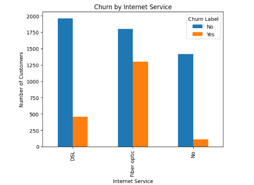
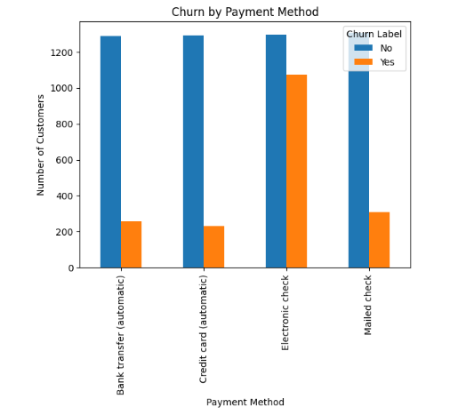
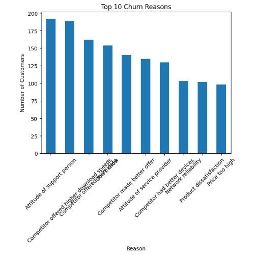

# Customer Retention Analysis: Why Are Customers Leaving?

# Business Problem

A telecommunications company is losing customers faster than expected. Acquiring new customers is significantly more expensive than retaining existing ones, making customer retention a major financial concern.

## Project Overview

This project analyzes customer retention behavior for a telecommunications company using customer demographics, service subscriptions, payment methods, contract types, and account information.

The goal of this project is to answer the following questions:

* Which customers are most likely to cancel?
* What services are associated with higher retention rates?
* Which customer characteristics indicate retention risk?
* What factors contribute most to customer attrition?

**Tools Used:** Python, Pandas, Matplotlib, Jupyter Notebook

---

# Data Exploration

## Overall 
**Dataset:** Telco Customer Retention

**Records:** 7,043 Customers

**Features:** 33 Columns

| Retention Status | Customers |
| ------------ | --------: |
| No           |     5,174 |
| Yes          |     1,869 |

### 

**26.54%**

---

# Contract Analysis
Does contract length affect customer retention?

Long-term contracts generally increase customer commitment, but they may also discourage new customers. This analysis investigates whether customers on month-to-month contracts leave more frequently than customers on annual contracts.

##  by Contract Type

| Contract Type  |  |
| -------------- | ---------: |
| Month-to-month |     42.71% |
| One year       |     11.27% |
| Two year       |      2.83% |

### Key Finding

Customers with month-to-month contracts are substantially more likely to leave than customers with long-term contracts.

Longer contract commitments are strongly associated with customer retention.

---

# Internet Service Analysis

##  by Internet Service

| Internet Service    |  |
| ------------------- | ---------: |
| Fiber optic         |     41.89% |
| DSL                 |     18.95% |
| No Internet Service |      7.05% |

### Key Finding

Customers subscribed to fiber internet experienced noticeably higher s than DSL customers. While fiber service typically offers better performance, this result suggests that pricing, customer expectations, or service quality issues may outweigh its benefits. This finding indicates that the company should investigate customer satisfaction within its fiber product line before focusing solely on acquisition.

---

# Payment Method Analysis

## Retention Rate by Payment Method

| Payment Method            | Retention Rate |
| ------------------------- | ---------: |
| Electronic Check          |     45.29% |
| Mailed Check              |     19.11% |
| Bank Transfer (Automatic) |     16.71% |
| Credit Card (Automatic)   |     15.24% |

### Key Finding

Customers using electronic checks are significantly more likely to retention compared to customers enrolled in automatic payment methods.

---

# Senior Citizen Analysis

## Retention Rate by Senior Citizen Status

| Senior Citizen | Retention Rate |
| -------------- | ---------: |
| Yes            |     41.68% |
| No             |     23.61% |

### Key Finding

Senior citizens demonstrate substantially higher retention rates than non-senior customers.

---

# Tenure Analysis

## Key Finding

Customer tenure emerged as one of the strongest indicators of retention behavior.

Customers who left generally had significantly shorter tenures compared to retained customers, suggesting that retention risk is highest during the early stages of the customer lifecycle.

---

# Monthly Charges Analysis

## Key Finding

Customers with higher monthly charges were more likely to leave than customers with lower monthly charges.

This indicates that pricing and perceived value may play a role in customer retention.

---

# Retention Reasons Analysis

## Key Finding

Analysis of retention reasons identified several recurring drivers of customer attrition, including:

* Competitor offers
* Pricing concerns
* Customer support issues
* Product dissatisfaction

---

# Business Recommendations

### 1. Promote Long-Term Contracts

Month-to-month customers exhibit the highest retention rates. Incentivizing annual or multi-year contracts may improve retention.

### 2. Improve Fiber Optic Customer Experience

Fiber optic subscribers show significantly elevated retention rates and should be prioritized for service quality and satisfaction rates.

### 3. Encourage Automatic Payments

Customers using electronic checks retention at substantially higher rates than customers enrolled in automatic payment methods.

### 4. Focus on Early Customer Retention

Customers with shorter tenure demonstrate greater retention risk, highlighting the importance of onboarding and early engagement programs.

### 5. Monitor High-Risk Customer Segments

Senior citizens and high monthly-charge customers represent key populations for proactive retention.

---

# Technologies Used

* Python
* Pandas
* Matplotlib
* Jupyter Notebook

